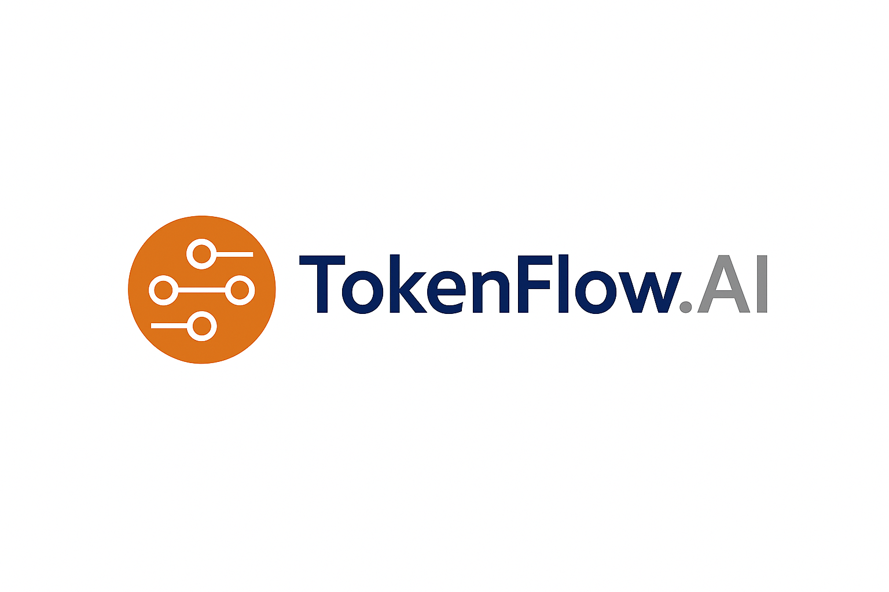

[](https://github.com/AndrewClements84/TokenFlow.AI/actions)
[](https://codecov.io/gh/AndrewClements84/TokenFlow.AI)
[](https://www.nuget.org/packages/TokenFlow.AI)
[](https://www.nuget.org/packages/TokenFlow.AI)
[](LICENSE)

---

### 💡 Overview

**TokenFlow.AI** is a lightweight .NET library for **tokenization**, **chunking**, and **cost estimation** across modern large language models (LLMs) like OpenAI GPT-4o and Anthropic Claude.

It forms the **core engine** of the *Flow.AI* ecosystem — powering accurate token counting, text splitting, and real-time cost tracking for AI-driven applications.

---

### 🧩 Key Features

- 🔢 GPT-style **token counting** for .NET  
- 🧱 Smart **text chunking** with configurable token limits  
- 💰 Real-time **cost estimation** for input/output usage  
- 🔌 Pluggable **tokenizer providers** (OpenAI, Anthropic, Azure AI)  
- 📦 **Zero external dependencies** — small, fast, portable  
- 🧠 Designed for use in **PromptStream.AI** and **DataFlow.AI**

---

### 🚀 Installation

```bash
dotnet add package TokenFlow.AI
```

Or install the core contracts only:

```bash
dotnet add package TokenFlow.Core
```

---

### 🧠 Quick Example

```csharp
using TokenFlow.AI.Costing;
using TokenFlow.AI.Tokenizer;
using TokenFlow.Core.Models;

var model = new ModelSpec("gpt-4o", "openai", "approx", 128000, 4096, 0.01m, 0.03m);
var tokenizer = new ApproxTokenizer();
var estimator = new CostEstimator();

string input = "TokenFlow.AI makes cost tracking easy!";
int tokenCount = tokenizer.CountTokens(input);

var result = new TokenCountResult(tokenCount, 0, tokenCount);
decimal cost = estimator.EstimateTotalCost(result, model);

Console.WriteLine($"Tokens: {tokenCount}, Estimated cost: {cost:C4}");
```

---

### 🧪 Running Tests

```bash
dotnet test --no-build --verbosity normal
```

All unit tests are implemented using **xUnit** and run automatically via GitHub Actions.

---

### 🧭 Part of the Flow.AI Ecosystem

| Package | Purpose |
|----------|----------|
| 🧠 **TokenFlow.AI** | Core tokenization & cost estimation |
| 💬 **PromptStream.AI** | Prompt composition & validation |
| 📊 **DataFlow.AI** | Data ingestion & streaming pipelines |

---

### 💬 Contributing

Pull requests are welcome!  
If you’d like to contribute to the **Flow.AI** ecosystem, please read the upcoming `CONTRIBUTING.md` once published.

---

### 🪪 License

Distributed under the **MIT License**.  
See [`LICENSE`](LICENSE) for details.

